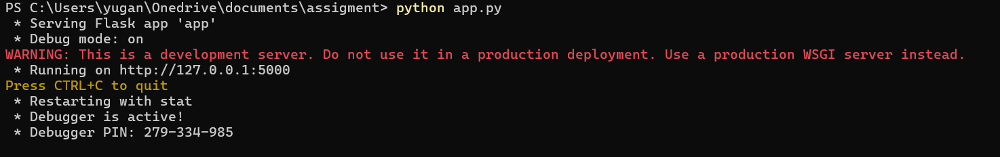
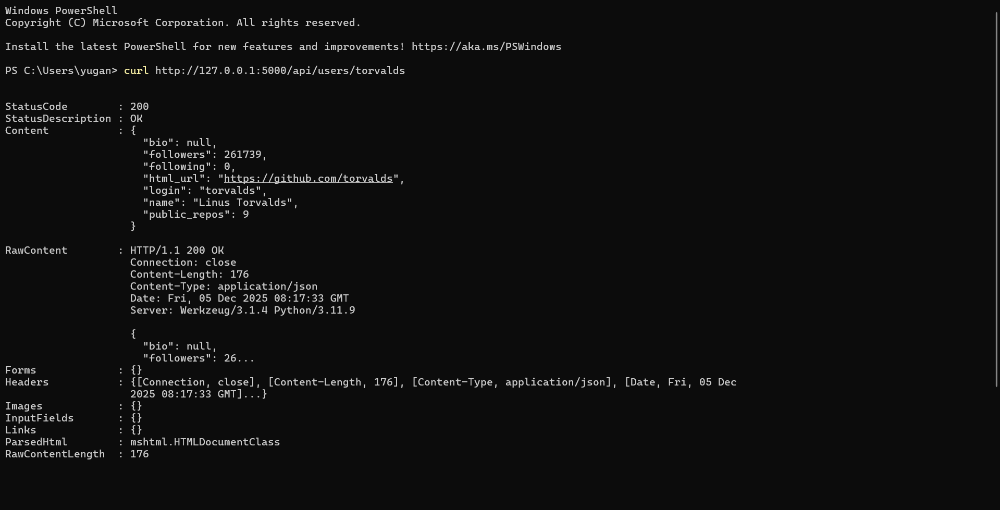
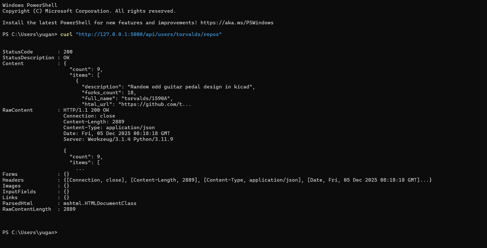
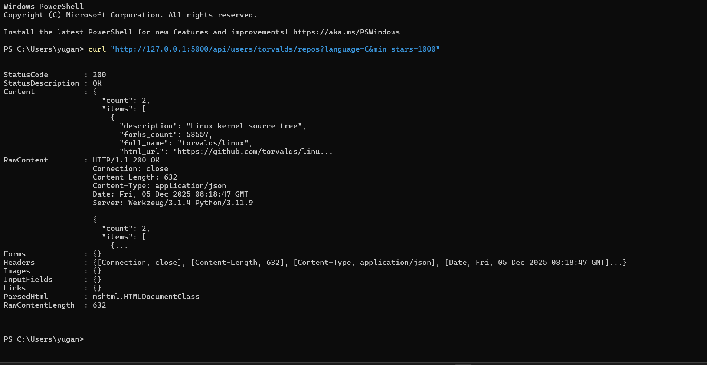
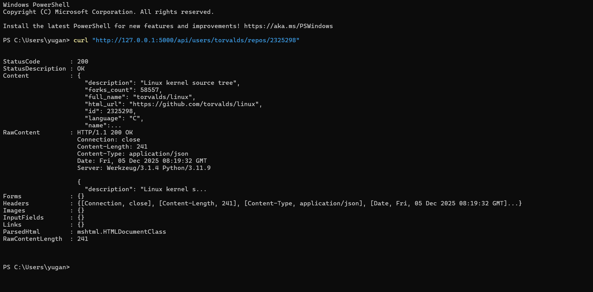

**API Integration Assignment – GitHub User & Repository Explorer**

A Flask-based API wrapper that integrates with the public GitHub REST API, fetches user and repository data, applies filtering, caches results, and exposes clean API endpoints.

This project fulfills all requirements outlined in the Global Trend – API Integration Internship Assignment.

**📌 Features**

Fetch data from two GitHub REST API endpoints

In-memory caching to reduce redundant API calls

Filtering options for repositories

Detailed view of a single repository by ID

Structured JSON output

Error handling for:

Timeouts

Network failures

Invalid responses

Missing/malformed fields

Incorrect user input

**🚀 Tech Stack**

Python 3

Flask (backend framework)

Requests (HTTP client)

**🔧 Setup Instructions**
1. Clone the repository
git clone https://github.com/YugankAdhikari/api-integration-assignment 
cd api-integration-assignment

2. Create & activate virtual environment (optional but recommended)

Windows

python -m venv venv
.\venv\Scripts\activate

3. Install dependencies
pip install -r requirements.txt

Or manually:

pip install flask requests

4. Run the server
python app.py

If successful, you will see:

 * Serving Flask app 'app'
 * Running on http://127.0.0.1:5000

**📡 Public API Endpoints Used**

This project uses the GitHub REST API (no API key required):

User information
https://api.github.com/users/{username}

User repositories
https://api.github.com/users/{username}/repos

**🧠 Your Flask API Endpoints**
1. Get user info
GET /api/users/<username>

Returns basic GitHub profile details.

Example
GET http://127.0.0.1:5000/api/users/torvalds

Sample Response
{
  "login": "torvalds",
  "name": "Linus Torvalds",
  "followers": 261000,
  "public_repos": 9,
  "html_url": "https://github.com/torvalds"
}

2. List a user’s repositories
GET /api/users/<username>/repos
Filtering Options
Query Parameter	Type	Description
language	string	Show only repos written in this language
min_stars	integer	Show only repos with stars >= this number
Example
GET http://127.0.0.1:5000/api/users/torvalds/repos?language=C&min_stars=1000

Sample Response
{
  "count": 2,
  "items": [ ... ]
}

3. View a single repository by ID
GET /api/users/<username>/repos/<repo_id>

Retrieves full details of one repository.

Example
GET http://127.0.0.1:5000/api/users/torvalds/repos/2325298

If repo doesn’t exist:

{"error": "Repository not found"}

**⚠️ Error Handling**

This API includes handling for:

Invalid parameters
GET /api/users/torvalds/repos?min_stars=abc

Response:

{"error": "min_stars must be an integer"}

REST API request failures

Timeout

Network failure

GitHub 4xx/5xx errors

Malformed JSON

When GitHub fails, our API returns a structured 502 Bad Gateway response:

{
  "error": "GitHub returned an error",
  "status_code": 404
}

**🗄️ Data Caching**

To reduce repeated GitHub calls, responses are cached in memory:

CACHE = {
  "users": {},
  "repos": {}
}

Request repeated URLs → served instantly from memory

Cache resets every time the server restarts

**## 📸 Screenshots**

### 1. Server Running

### 2. User Endpoint

### 3. Repositories List

### 4. Filtered Repos

### 5. Single Repo Detail

### 6. Error Handling

